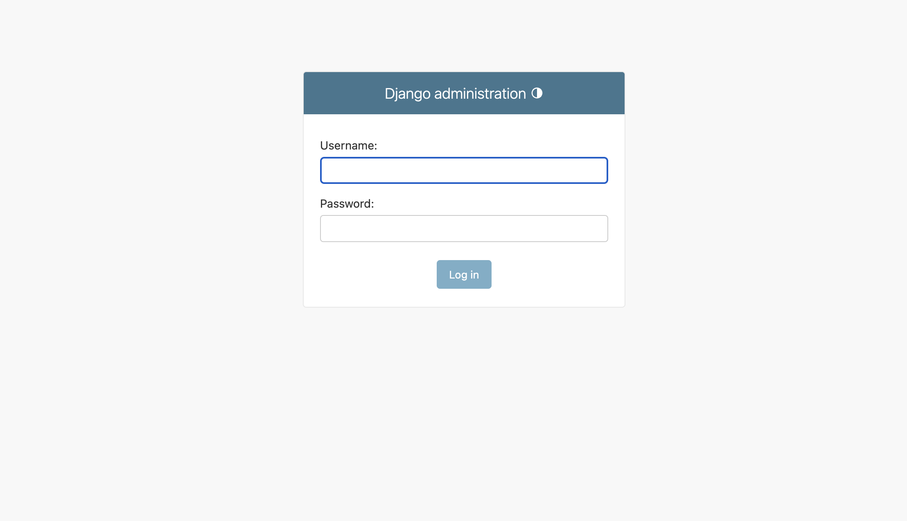

# Service Desk App
## For Software Engineering & Agile
This app is designed to provide simple functions around CRUD of a database. The app itself is a 'service desk'- users can raise issues around their devices, and admins will be able to change the status of these issues depending on their status.
## Pre-requisites
App was built using python 3.9.  
Django is the chosen framework; this project was built using 4.2.6.  
Unittest is used for unit testing. This is supported and included with django.  
sqlite is used for database.  This is supported and included with python.  
## Starting the app
### 1. Build
To generate the database, run these commands a line at a time in your terminal at the root of the project:  
  
`python manage.py sqlmigrate helpdeskapplication 0001`  
  
`python manage.py migrate`

And finally, to populate the user table with an admin:  

`python manage.py createsuperuser`  

follow the prompts in terminal to create a super user.  
  
### 2. Starting the application
in terminal, run  
  
  `python manage.py runserver`  
    
and head to the URL http://127.0.0.1:8000/admin/ .
This you should be presented with a login page that looks like this:
